# 👋 Hi, I'm Ahmethan Abacı

💻 **Management Information Systems Student (Graduating in 2026)**  
🌱 Junior **Data Science & Web Developer**  
🎮 Background in **Game Development** & **Web Development**  
🚀 Passionate about learning, growing, and contributing to impactful projects  
🌍 Aiming for a future international career and Master's studies  

---

## 🔧 Skills & Tools

### Data Science & ML
  
  
  
  
  

### Web & Game Development
  
  
  

### Tools & Platforms

---

## 📊 GitHub Stats
  

---

## 💼 Projects

### 📊 Data Science Projects
[GitHub Repo: data-science-projects](https://github.com/AhmethanAbaci/data-science-projects)

This repository contains my **hands-on Data Science projects**, including data preprocessing, visualization, machine learning models, and evaluation techniques.

**Featured Projects:**
- **Study Hours vs Exam Scores:** Linear regression to predict exam performance based on study hours.  
- **Multiple Regression:** Predict target variables using multiple features.  
- **Data Preprocessing & Visualization:** Cleaning and visualizing datasets.

---

### 🫁 Pneumonia Detection
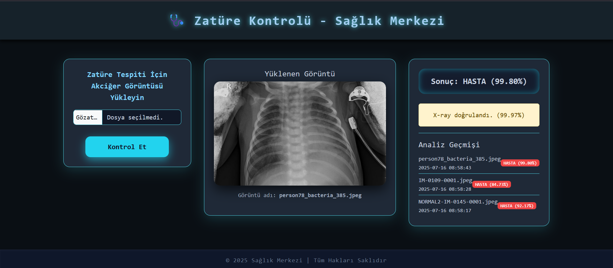
- **Python, Keras, Conv2D**  
- Image classification model to detect pneumonia  

### ☕ Hermanos Cafe Website

  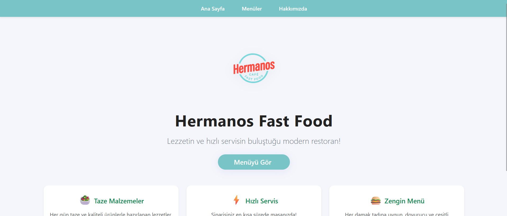
  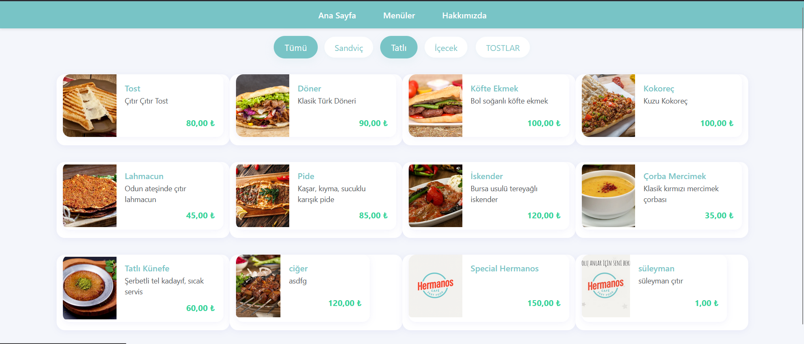
  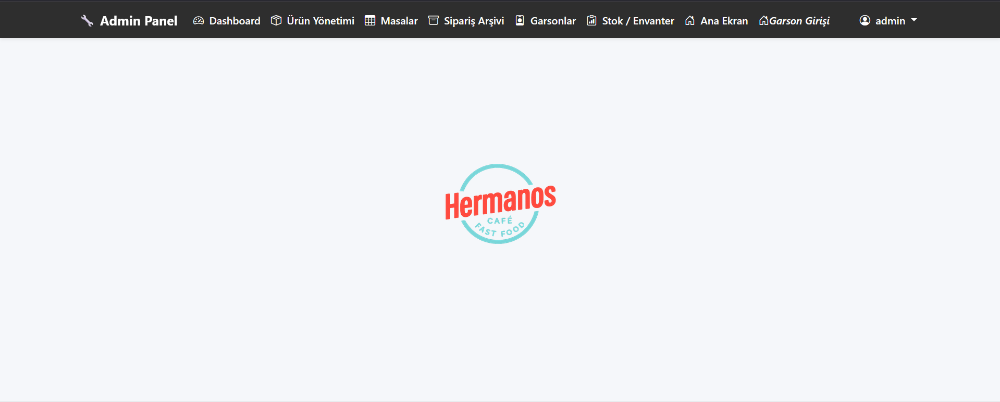
  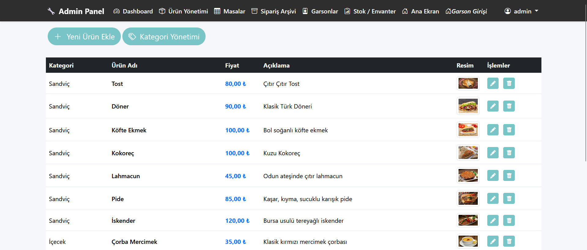

- **Technologies:** HTML, CSS, JavaScript, ASP.NET, SignalR  
- Modern, user-friendly design with fast service emphasis  
- Contact number integration for orders  
- **Live Site:** [hermanoscafe.com.tr](https://hermanoscafe.com.tr/)

### 🎮 Mini Games (Unity)

  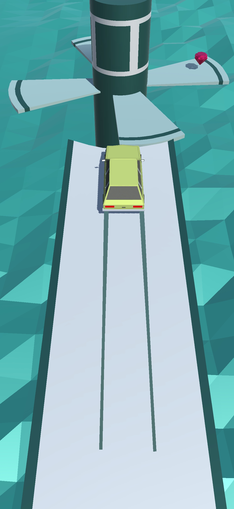
  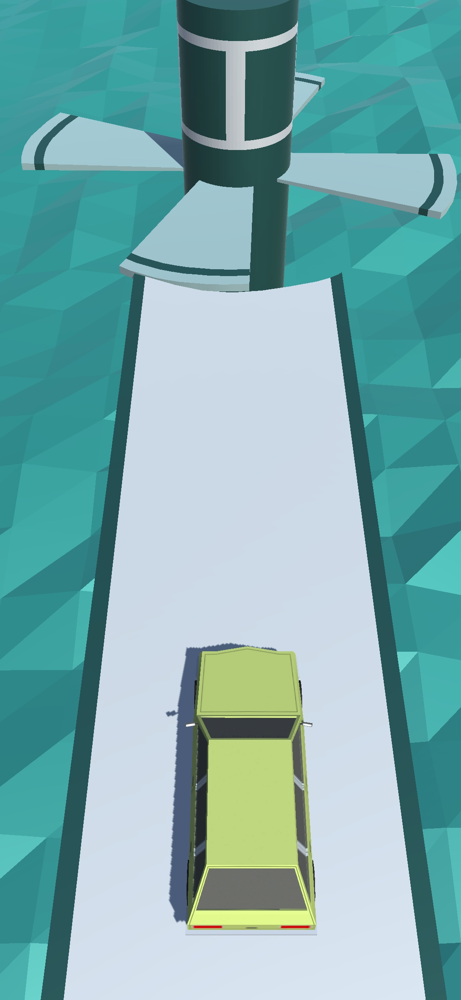
  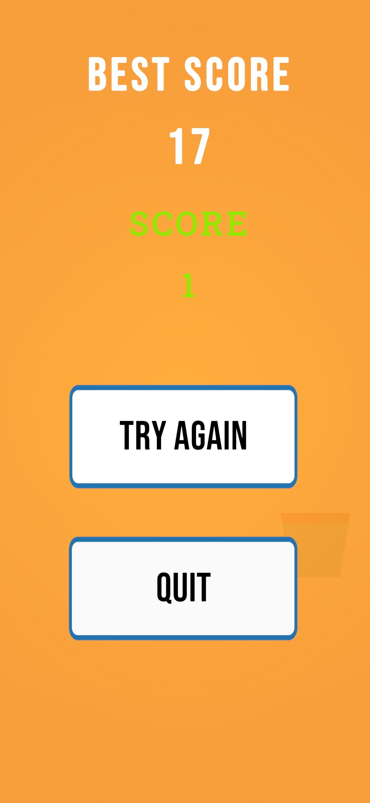
  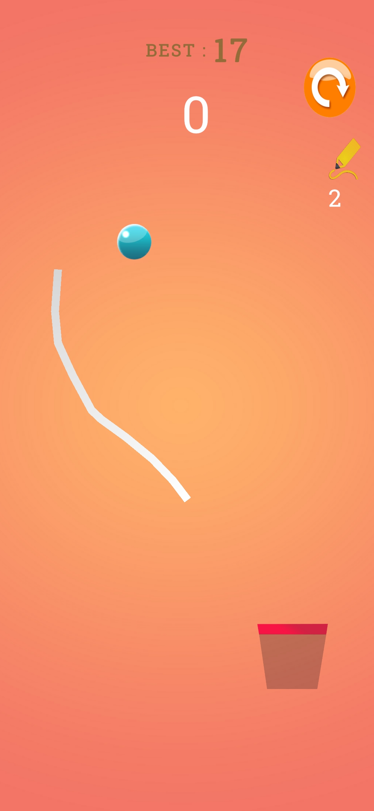

- **C#, Unity**  
- Focus on small features and coding practice  

### ❤️ Heart Health Prediction (RNN)

  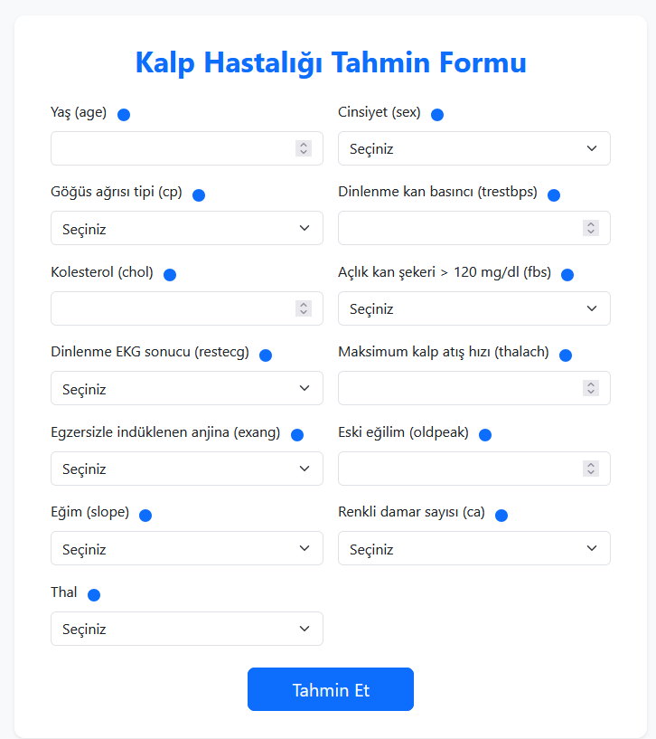
  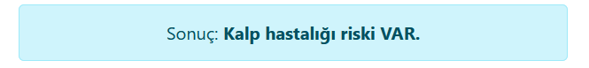

- Predicting heart health risk using time series data  

### 🌐 Mini Website
- [Live Site](https://ahmethanabaci.netlify.app/)

---

## 🎯 Current Goals
- Gain hands-on experience in **Data Science & AI projects**  
- Grow as a **junior developer** through learning and collaboration  
- Apply creativity and technical skills to deliver **small but meaningful solutions**  
- Build a foundation for a **future international career and Master's studies**
